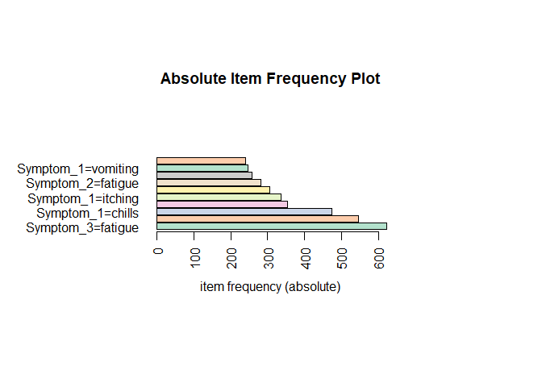
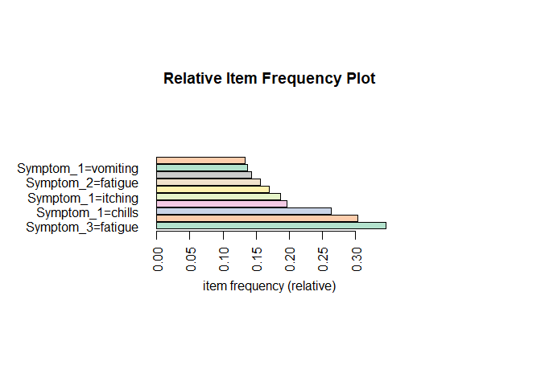
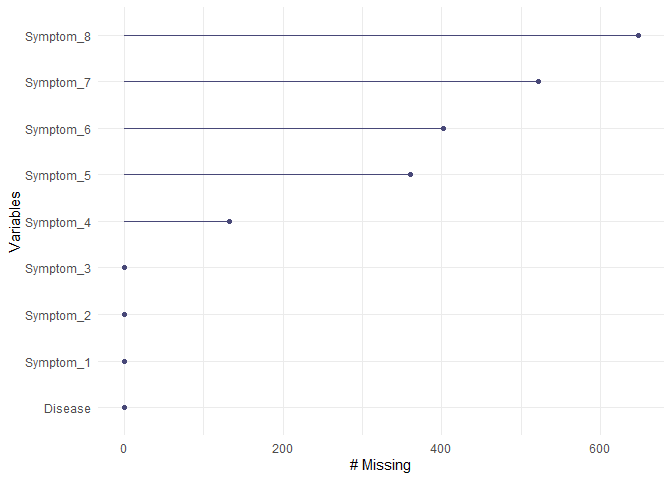
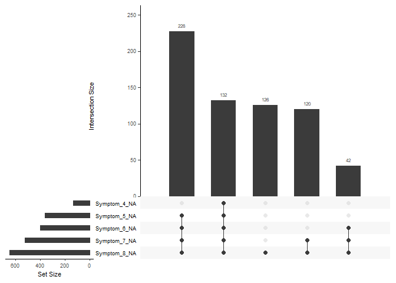

## R Markdown

This is an R Markdown document. Markdown is a simple formatting syntax
for authoring HTML, PDF, and MS Word documents. For more details on
using R Markdown see <http://rmarkdown.rstudio.com>.

When you click the **Knit** button a document will be generated that
includes both content as well as the output of any embedded R code
chunks within the document. You can embed an R code chunk like this:

LOADING DATASET

    library(readr)
    dataset <- read_csv("D:/Kaguash/Downloads/Symptom-Disease-ClassifierBI-Project/data/communicable_dataset.csv")

    ## Rows: 1800 Columns: 9
    ## ── Column specification ────────────────────────────────────────────────────────
    ## Delimiter: ","
    ## chr (9): Disease, Symptom_1, Symptom_2, Symptom_3, Symptom_4, Symptom_5, Sym...
    ## 
    ## ℹ Use `spec()` to retrieve the full column specification for this data.
    ## ℹ Specify the column types or set `show_col_types = FALSE` to quiet this message.

    View(dataset)

Issue 2

    # Measure of Frequency
    disease_frequencies <- table(dataset$Disease)

    # Measure of Central Tendency
    mean_disease_length <- mean(nchar(dataset$Disease))
    median_disease_length <- median(nchar(dataset$Disease))
    mode_disease <- names(which.max(disease_frequencies))

    # Measure of Distribution
    sd_disease_length <- sd(nchar(dataset$Disease))

    # Measure of Relationship
    #disease_association <- chisq.test(dataset$Disease)

    # Print results
    print(disease_frequencies)

    ## 
    ##     Alcoholic hepatitis             Chicken pox             Common Cold 
    ##                     120                     120                     120 
    ##                  Dengue        Fungal infection         Gastroenteritis 
    ##                     120                     120                     120 
    ##             Hepatitis B             Hepatitis C             Hepatitis D 
    ##                     120                     120                     120 
    ##             Hepatitis E                 Malaria               Pneumonia 
    ##                     120                     120                     120 
    ##            Tuberculosis                 Typhoid Urinary tract infection 
    ##                     120                     120                     120

    print(mean_disease_length)

    ## [1] 12

    print(median_disease_length)

    ## [1] 11

    print(mode_disease)

    ## [1] "Alcoholic hepatitis"

    print(sd_disease_length)

    ## [1] 4.443456

    #print(disease_association)
    head(dataset)

    ## # A tibble: 6 × 9
    ##   Disease  Symptom_1 Symptom_2 Symptom_3 Symptom_4 Symptom_5 Symptom_6 Symptom_7
    ##   <chr>    <chr>     <chr>     <chr>     <chr>     <chr>     <chr>     <chr>    
    ## 1 Fungal … itching   skin_rash nodal_sk… dischrom… <NA>      <NA>      <NA>     
    ## 2 Fungal … skin_rash nodal_sk… dischrom… <NA>      <NA>      <NA>      <NA>     
    ## 3 Fungal … itching   nodal_sk… dischrom… <NA>      <NA>      <NA>      <NA>     
    ## 4 Fungal … itching   skin_rash dischrom… <NA>      <NA>      <NA>      <NA>     
    ## 5 Fungal … itching   skin_rash nodal_sk… <NA>      <NA>      <NA>      <NA>     
    ## 6 Fungal … skin_rash nodal_sk… dischrom… <NA>      <NA>      <NA>      <NA>     
    ## # ℹ 1 more variable: Symptom_8 <chr>

    # Check unique levels in Disease and Symptom_1
    table(dataset$Disease)

    ## 
    ##     Alcoholic hepatitis             Chicken pox             Common Cold 
    ##                     120                     120                     120 
    ##                  Dengue        Fungal infection         Gastroenteritis 
    ##                     120                     120                     120 
    ##             Hepatitis B             Hepatitis C             Hepatitis D 
    ##                     120                     120                     120 
    ##             Hepatitis E                 Malaria               Pneumonia 
    ##                     120                     120                     120 
    ##            Tuberculosis                 Typhoid Urinary tract infection 
    ##                     120                     120                     120

    table(dataset$Symptom_1)

    ## 
    ##  bladder_discomfort burning_micturition              chills continuous_sneezing 
    ##                  12                 108                 474                 114 
    ##             fatigue             itching          joint_pain           skin_rash 
    ##                 126                 336                 228                 132 
    ##         sunken_eyes            vomiting      yellowish_skin 
    ##                  12                 246                  12

    # Perform chi-square test of independence
    chisq_result <- chisq.test(dataset$Disease, dataset$Symptom_1)

    ## Warning in chisq.test(dataset$Disease, dataset$Symptom_1): Chi-squared
    ## approximation may be incorrect

    print(chisq_result)

    ## 
    ##  Pearson's Chi-squared test
    ## 
    ## data:  dataset$Disease and dataset$Symptom_1
    ## X-squared = 11628, df = 140, p-value < 2.2e-16

Issue 3

    # Load your dataset (replace 'your_data.csv' with your actual data file)
    data <- read_csv("D:/Kaguash/Downloads/Symptom-Disease-ClassifierBI-Project/data/communicable_dataset.csv")

    ## Rows: 1800 Columns: 9
    ## ── Column specification ────────────────────────────────────────────────────────
    ## Delimiter: ","
    ## chr (9): Disease, Symptom_1, Symptom_2, Symptom_3, Symptom_4, Symptom_5, Sym...
    ## 
    ## ℹ Use `spec()` to retrieve the full column specification for this data.
    ## ℹ Specify the column types or set `show_col_types = FALSE` to quiet this message.

    # Convert character data type to factor data type
    data[, c("Disease", "Symptom_1", "Symptom_2", "Symptom_3", "Symptom_4", "Symptom_5", "Symptom_6", "Symptom_7", "Symptom_8")] <- lapply(data[, c("Disease", "Symptom_1", "Symptom_2", "Symptom_3", "Symptom_4", "Symptom_5", "Symptom_6", "Symptom_7", "Symptom_8")], as.factor)

Issue 4

    ## Loading required package: Matrix

    ## 
    ## Attaching package: 'arules'

    ## The following objects are masked from 'package:base':
    ## 
    ##     abbreviate, write

Issue 5

    # Load required libraries
    ## plyr ----
    library(plyr)

    library(dplyr)

    ## 
    ## Attaching package: 'dplyr'

    ## The following objects are masked from 'package:plyr':
    ## 
    ##     arrange, count, desc, failwith, id, mutate, rename, summarise,
    ##     summarize

    ## The following objects are masked from 'package:arules':
    ## 
    ##     intersect, recode, setdiff, setequal, union

    ## The following objects are masked from 'package:stats':
    ## 
    ##     filter, lag

    ## The following objects are masked from 'package:base':
    ## 
    ##     intersect, setdiff, setequal, union

    library(caret)

    ## Loading required package: ggplot2

    ## Loading required package: lattice

    library(randomForest)  # You can choose another classification algorithm

    ## randomForest 4.7-1.1

    ## Type rfNews() to see new features/changes/bug fixes.

    ## 
    ## Attaching package: 'randomForest'

    ## The following object is masked from 'package:ggplot2':
    ## 
    ##     margin

    ## The following object is masked from 'package:dplyr':
    ## 
    ##     combine

    data <- read_csv("D:/Kaguash/Downloads/Symptom-Disease-ClassifierBI-Project/data/communicable_dataset.csv")

    ## Rows: 1800 Columns: 9

    ## ── Column specification ────────────────────────────────────────────────────────
    ## Delimiter: ","
    ## chr (9): Disease, Symptom_1, Symptom_2, Symptom_3, Symptom_4, Symptom_5, Sym...
    ## 
    ## ℹ Use `spec()` to retrieve the full column specification for this data.
    ## ℹ Specify the column types or set `show_col_types = FALSE` to quiet this message.

    # Remove unnecessary columns
    data <- data[, c("Disease", "Symptom_1", "Symptom_2", "Symptom_3", "Symptom_4", "Symptom_5", "Symptom_6", "Symptom_7", "Symptom_8")]

    # Convert character data type to factor data type
    data[, c("Disease", "Symptom_1", "Symptom_2", "Symptom_3", "Symptom_4", "Symptom_5", "Symptom_6", "Symptom_7", "Symptom_8")] <- lapply(data[, c("Disease", "Symptom_1", "Symptom_2", "Symptom_3", "Symptom_4", "Symptom_5", "Symptom_6", "Symptom_7", "Symptom_8")], as.factor)

    #Data transformation

    #confirmation of missing data
    sapply(data, function(x) sum(is.na(x)))

    ##   Disease Symptom_1 Symptom_2 Symptom_3 Symptom_4 Symptom_5 Symptom_6 Symptom_7 
    ##         0         0         0         0       132       360       402       522 
    ## Symptom_8 
    ##       648

    # Summary of missing values
    summary(data)

    ##                 Disease          Symptom_1                Symptom_2  
    ##  Alcoholic hepatitis: 120   chills    :474   vomiting          :546  
    ##  Chicken pox        : 120   itching   :336   fatigue           :282  
    ##  Common Cold        : 120   vomiting  :246   chills            :216  
    ##  Dengue             : 120   joint_pain:228   yellowish_skin    :216  
    ##  Fungal infection   : 120   skin_rash :132   skin_rash         :204  
    ##  Gastroenteritis    : 120   fatigue   :126   bladder_discomfort:102  
    ##  (Other)            :1080   (Other)   :258   (Other)           :234  
    ##           Symptom_3              Symptom_4            Symptom_5  
    ##  fatigue       :624   high_fever      :354   headache      :258  
    ##  high_fever    :144   yellowish_skin  :216   high_fever    :240  
    ##  cough         :120   cough           :120   dark_urine    :210  
    ##  lethargy      :120   lethargy        : 96   breathlessness: 90  
    ##  abdominal_pain:102   loss_of_appetite: 96   cough         : 90  
    ##  joint_pain    :102   (Other)         :786   (Other)       :552  
    ##  (Other)       :588   NA's            :132   NA's          :360  
    ##             Symptom_6              Symptom_7               Symptom_8  
    ##  nausea          :306   loss_of_appetite:198   abdominal_pain   :204  
    ##  headache        :204   abdominal_pain  :144   loss_of_appetite :162  
    ##  high_fever      :168   malaise         :120   phlegm           :120  
    ##  loss_of_appetite:156   nausea          :114   yellowing_of_eyes: 96  
    ##  dark_urine      : 84   constipation    : 96   nausea           : 84  
    ##  (Other)         :480   (Other)         :606   (Other)          :486  
    ##  NA's            :402   NA's            :522   NA's             :648

Issue 6

    library(naniar)

    # Visualize missing data patterns
    gg_miss_var(data)

    gg_miss_upset(data)

    # Split the data into training and testing sets
    set.seed(123)
    trainIndex <- createDataPartition(data$Disease, p = .7, list = FALSE, times = 1)
    train <- data[trainIndex, ]
    test <- data[-trainIndex, ]

    # Train a decision tree model
    library(rpart)
    model_decision_tree <- rpart(Disease ~ ., data = train)

    # Remove rows with missing values
    train <- na.omit(train)
    # Impute missing values in 'train' dataset (using mean as an example)
    train$Disease <- ifelse(is.na(train$Disease), mean(train$Disease, na.rm = TRUE), train$Disease)
    # Build random forest model after handling missing values
    library(randomForest)
    # Train a random forest model on the training data
    model_decision_tree <- randomForest(Disease ~ ., data = train)

    # Use the trained model to make predictions on the test data
    #predictions <- predict(model, test)
    # Check levels of categorical variables in the training dataset
    sapply(train, function(x) if(is.factor(x)) levels(x))

    ## $Disease
    ## NULL
    ## 
    ## $Symptom_1
    ##  [1] "bladder_discomfort"  "burning_micturition" "chills"             
    ##  [4] "continuous_sneezing" "fatigue"             "itching"            
    ##  [7] "joint_pain"          "skin_rash"           "sunken_eyes"        
    ## [10] "vomiting"            "yellowish_skin"     
    ## 
    ## $Symptom_2
    ##  [1] "abdominal_pain"       "bladder_discomfort"   "chills"              
    ##  [4] "cough"                "dehydration"          "fatigue"             
    ##  [7] "foul_smell_of urine"  "high_fever"           "joint_pain"          
    ## [10] "lethargy"             "nausea"               "nodal_skin_eruptions"
    ## [13] "skin_rash"            "sunken_eyes"          "vomiting"            
    ## [16] "yellowish_skin"      
    ## 
    ## $Symptom_3
    ##  [1] "abdominal_pain"           "continuous_feel_of_urine"
    ##  [3] "cough"                    "dehydration"             
    ##  [5] "diarrhoea"                "dischromic _patches"     
    ##  [7] "fatigue"                  "foul_smell_of urine"     
    ##  [9] "high_fever"               "joint_pain"              
    ## [11] "lethargy"                 "loss_of_appetite"        
    ## [13] "nausea"                   "nodal_skin_eruptions"    
    ## [15] "sweating"                 "swelling_of_stomach"     
    ## [17] "vomiting"                 "weight_loss"             
    ## [19] "yellowish_skin"          
    ## 
    ## $Symptom_4
    ##  [1] "breathlessness"           "continuous_feel_of_urine"
    ##  [3] "cough"                    "dark_urine"              
    ##  [5] "diarrhoea"                "dischromic _patches"     
    ##  [7] "distention_of_abdomen"    "fatigue"                 
    ##  [9] "headache"                 "high_fever"              
    ## [11] "lethargy"                 "loss_of_appetite"        
    ## [13] "sweating"                 "swelling_of_stomach"     
    ## [15] "vomiting"                 "weight_loss"             
    ## [17] "yellowing_of_eyes"        "yellowish_skin"          
    ## 
    ## $Symptom_5
    ##  [1] "breathlessness"                 "cough"                         
    ##  [3] "dark_urine"                     "distention_of_abdomen"         
    ##  [5] "family_history"                 "fatigue"                       
    ##  [7] "headache"                       "high_fever"                    
    ##  [9] "history_of_alcohol_consumption" "loss_of_appetite"              
    ## [11] "nausea"                         "sweating"                      
    ## [13] "yellowing_of_eyes"              "yellowish_skin"                
    ## 
    ## $Symptom_6
    ##  [1] "abdominal_pain"                 "breathlessness"                
    ##  [3] "constipation"                   "dark_urine"                    
    ##  [5] "diarrhoea"                      "family_history"                
    ##  [7] "fluid_overload"                 "headache"                      
    ##  [9] "high_fever"                     "history_of_alcohol_consumption"
    ## [11] "loss_of_appetite"               "malaise"                       
    ## [13] "nausea"                         "sweating"                      
    ## [15] "swelled_lymph_nodes"           
    ## 
    ## $Symptom_7
    ##  [1] "abdominal_pain"      "breathlessness"      "constipation"       
    ##  [4] "diarrhoea"           "fluid_overload"      "headache"           
    ##  [7] "loss_of_appetite"    "malaise"             "mild_fever"         
    ## [10] "muscle_pain"         "nausea"              "phlegm"             
    ## [13] "sweating"            "swelled_lymph_nodes" "yellow_urine"       
    ## 
    ## $Symptom_8
    ##  [1] "abdominal_pain"      "chest_pain"          "diarrhoea"          
    ##  [4] "loss_of_appetite"    "malaise"             "mild_fever"         
    ##  [7] "muscle_pain"         "nausea"              "phlegm"             
    ## [10] "sweating"            "swelled_lymph_nodes" "yellow_urine"       
    ## [13] "yellowing_of_eyes"

    # Check levels of categorical variables in the test dataset
    sapply(test, function(x) if(is.factor(x)) levels(x))

    ## $Disease
    ##  [1] "Alcoholic hepatitis"     "Chicken pox"            
    ##  [3] "Common Cold"             "Dengue"                 
    ##  [5] "Fungal infection"        "Gastroenteritis"        
    ##  [7] "Hepatitis B"             "Hepatitis C"            
    ##  [9] "Hepatitis D"             "Hepatitis E"            
    ## [11] "Malaria"                 "Pneumonia"              
    ## [13] "Tuberculosis"            "Typhoid"                
    ## [15] "Urinary tract infection"
    ## 
    ## $Symptom_1
    ##  [1] "bladder_discomfort"  "burning_micturition" "chills"             
    ##  [4] "continuous_sneezing" "fatigue"             "itching"            
    ##  [7] "joint_pain"          "skin_rash"           "sunken_eyes"        
    ## [10] "vomiting"            "yellowish_skin"     
    ## 
    ## $Symptom_2
    ##  [1] "abdominal_pain"       "bladder_discomfort"   "chills"              
    ##  [4] "cough"                "dehydration"          "fatigue"             
    ##  [7] "foul_smell_of urine"  "high_fever"           "joint_pain"          
    ## [10] "lethargy"             "nausea"               "nodal_skin_eruptions"
    ## [13] "skin_rash"            "sunken_eyes"          "vomiting"            
    ## [16] "yellowish_skin"      
    ## 
    ## $Symptom_3
    ##  [1] "abdominal_pain"           "continuous_feel_of_urine"
    ##  [3] "cough"                    "dehydration"             
    ##  [5] "diarrhoea"                "dischromic _patches"     
    ##  [7] "fatigue"                  "foul_smell_of urine"     
    ##  [9] "high_fever"               "joint_pain"              
    ## [11] "lethargy"                 "loss_of_appetite"        
    ## [13] "nausea"                   "nodal_skin_eruptions"    
    ## [15] "sweating"                 "swelling_of_stomach"     
    ## [17] "vomiting"                 "weight_loss"             
    ## [19] "yellowish_skin"          
    ## 
    ## $Symptom_4
    ##  [1] "breathlessness"           "continuous_feel_of_urine"
    ##  [3] "cough"                    "dark_urine"              
    ##  [5] "diarrhoea"                "dischromic _patches"     
    ##  [7] "distention_of_abdomen"    "fatigue"                 
    ##  [9] "headache"                 "high_fever"              
    ## [11] "lethargy"                 "loss_of_appetite"        
    ## [13] "sweating"                 "swelling_of_stomach"     
    ## [15] "vomiting"                 "weight_loss"             
    ## [17] "yellowing_of_eyes"        "yellowish_skin"          
    ## 
    ## $Symptom_5
    ##  [1] "breathlessness"                 "cough"                         
    ##  [3] "dark_urine"                     "distention_of_abdomen"         
    ##  [5] "family_history"                 "fatigue"                       
    ##  [7] "headache"                       "high_fever"                    
    ##  [9] "history_of_alcohol_consumption" "loss_of_appetite"              
    ## [11] "nausea"                         "sweating"                      
    ## [13] "yellowing_of_eyes"              "yellowish_skin"                
    ## 
    ## $Symptom_6
    ##  [1] "abdominal_pain"                 "breathlessness"                
    ##  [3] "constipation"                   "dark_urine"                    
    ##  [5] "diarrhoea"                      "family_history"                
    ##  [7] "fluid_overload"                 "headache"                      
    ##  [9] "high_fever"                     "history_of_alcohol_consumption"
    ## [11] "loss_of_appetite"               "malaise"                       
    ## [13] "nausea"                         "sweating"                      
    ## [15] "swelled_lymph_nodes"           
    ## 
    ## $Symptom_7
    ##  [1] "abdominal_pain"      "breathlessness"      "constipation"       
    ##  [4] "diarrhoea"           "fluid_overload"      "headache"           
    ##  [7] "loss_of_appetite"    "malaise"             "mild_fever"         
    ## [10] "muscle_pain"         "nausea"              "phlegm"             
    ## [13] "sweating"            "swelled_lymph_nodes" "yellow_urine"       
    ## 
    ## $Symptom_8
    ##  [1] "abdominal_pain"      "chest_pain"          "diarrhoea"          
    ##  [4] "loss_of_appetite"    "malaise"             "mild_fever"         
    ##  [7] "muscle_pain"         "nausea"              "phlegm"             
    ## [10] "sweating"            "swelled_lymph_nodes" "yellow_urine"       
    ## [13] "yellowing_of_eyes"

    # Ensure factor levels in test match those in train
    for (col in names(train)) {
      if (is.factor(train[[col]]) && is.factor(test[[col]])) {
        levels(test[[col]]) <- levels(train[[col]])
      }
    }

    #predictions <- predict(model, test)

    # Compare model performance using resampling methods
    library(caret)

    # Define control parameters for resampling
    control <- trainControl(method = "cv", number = 10)

    # Train a decision tree model using cross-validation
    model_cv <- train(Disease ~ ., data = train, method = "rpart", trControl = control)

    ## Warning in nominalTrainWorkflow(x = x, y = y, wts = weights, info = trainInfo,
    ## : There were missing values in resampled performance measures.

    # Summarize model performance
    print(model_cv)

    ## CART 
    ## 
    ## 804 samples
    ##   8 predictor
    ## 
    ## No pre-processing
    ## Resampling: Cross-Validated (10 fold) 
    ## Summary of sample sizes: 725, 724, 722, 724, 725, 723, ... 
    ## Resampling results across tuning parameters:
    ## 
    ##   cp          RMSE      Rsquared   MAE     
    ##   0.07056866  1.729942  0.8181372  1.145289
    ##   0.20526094  2.340098  0.6724157  1.852046
    ##   0.58006388  3.658667  0.5056391  3.192621
    ## 
    ## RMSE was used to select the optimal model using the smallest value.
    ## The final value used for the model was cp = 0.07056866.

Issue 7

    # Load necessary libraries
    library(caret)
    library(randomForest)

    # Define the grid of hyperparameters for mtry
    grid <- expand.grid(mtry = c(2, 4, 6, 8, 10)) # Vary the number of variables randomly sampled as candidates at each split

    # Set up the control parameters for grid search
    control <- trainControl(method = "cv", number = 5) 

    # Perform grid search for hyperparameters (only mtry)
    model_grid_search <- train(Disease ~ ., data = train, method = "rf",
                               trControl = control, tuneGrid = grid)

Note that the `echo = FALSE` parameter was added to the code chunk to
prevent printing of the R code that generated the plot.
